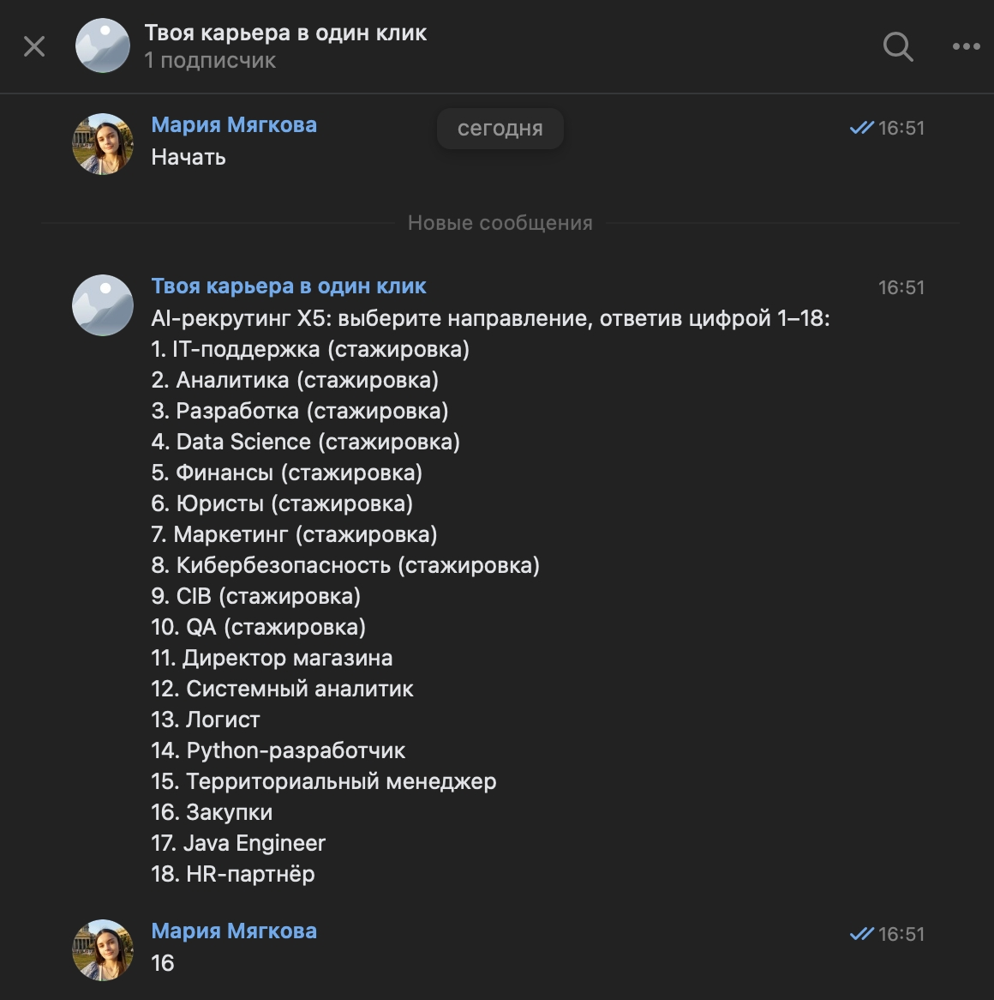
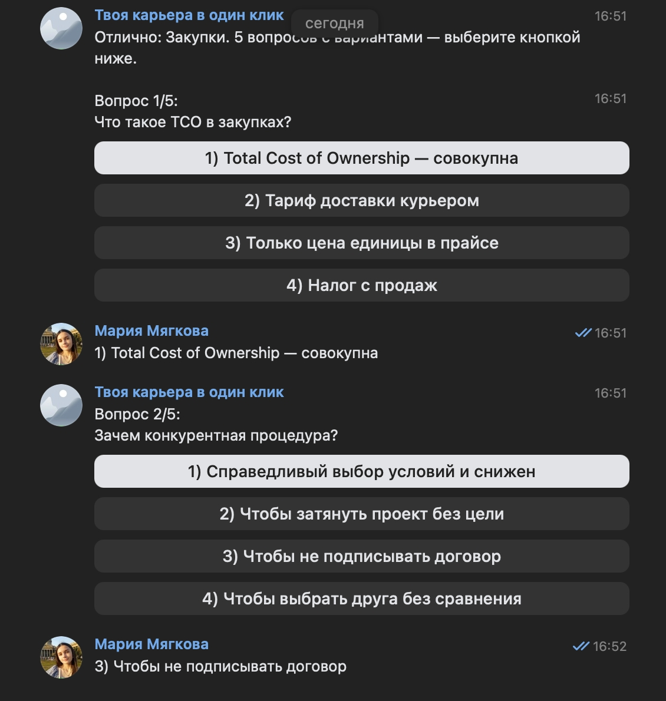
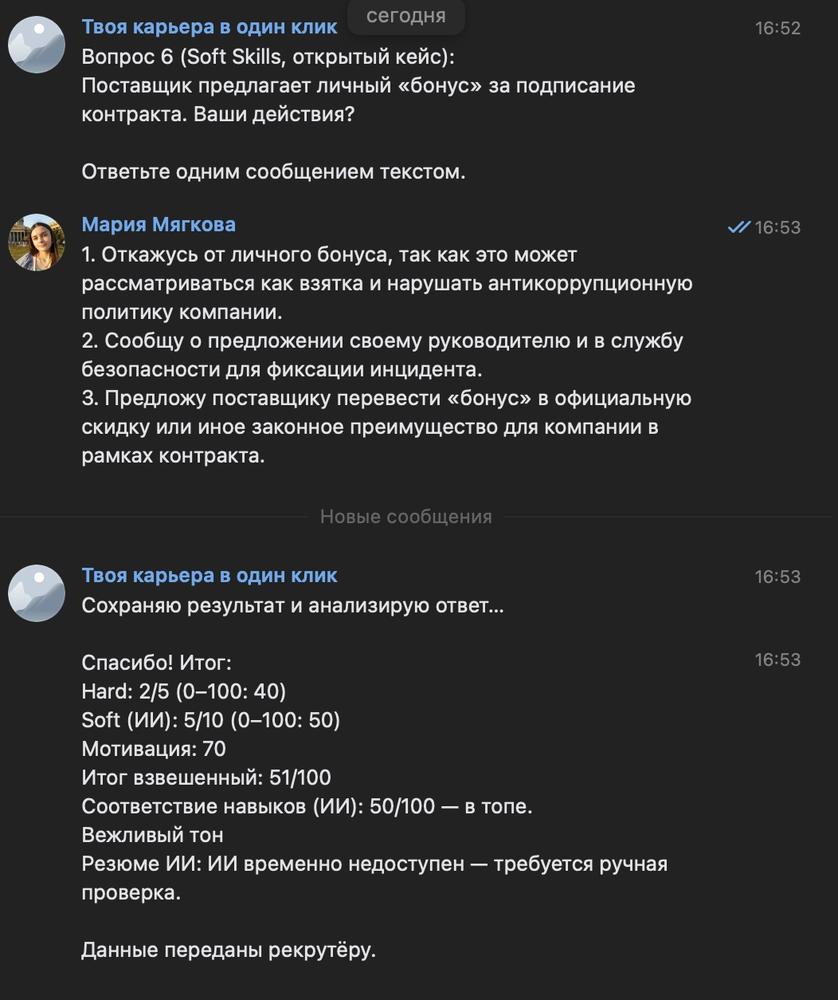

# HR-Flow AI (X5)

**HR-Flow AI** — это демо-проект системы «AI-рекрутинга». Сервис автоматизирует воронку найма: от первого касания на лендинге до оценки компетенций нейросетью GigaChat и ранжирования кандидатов в кабинете рекрутера.

## Стек технологий

* **Backend:** Node.js (Express)
* **Frontend:** HTML5, CSS3, JavaScript (Vanilla JS)
* **AI:** GigaChat API (анализ Soft Skills и Skill Fit)
* **Bot Platform:** VK API
* **Maps:** Яндекс.Карты API
* **Database:** Local JSON Storage (директория `data/`)

## Структура проекта

```text
short-hack/
├── bot/
│   ├── server.js        # Точка входа: Express-сервер и API-роуты
│   ├── vk-bot.js        # Логика VK-бота и интеграция с GigaChat
│   └── vacancies.js     # Контент вакансий, вопросы и веса для скоринга
├── public/
│   └── index.html       # Лендинг и кабинет рекрутера
├── data/                # Хранилище сессий и результатов кандидатов
├── .env.example         # Шаблон переменных окружения
├── package.json         # Список зависимостей
└── README.md            # Документация проекта

```

## Инструкция по запуску

### 1. Подготовка

Убедитесь, что у вас установлен **Node.js** (версия 16 или выше).

### 2. Клонирование и установка

```bash
git clone https://github.com/Maria-Myagkova/short-hack.git
cd short-hack
npm install

```

### 3. Настройка окружения

Создайте файл `.env` в корне проекта и заполните его:

```env
PORT=3780
VK_GROUP_ID=...          # Числовой ID вашего сообщества VK
VK_GROUP_TOKEN=...       # Ключ доступа сообщества
GIGACHAT_AUTH_KEY=...    # Basic-ключ для GigaChat

```

### 4. Запуск

```bash
node bot/server.js

```

Проект будет доступен по адресу: `http://localhost:3780`

---

## Функционал продукта

### 1. Лендинг и воронка

* Кандидат выбирает вакансию и заполняет анкету.
* Нажимает «Начать интервью» → переход в чат с VK-ботом с параметром `ref` (передает `vacancyId`).

### 2. VK-бот и AI-оценка

* **Hard Skills:** Викторина из 5 вопросов по специальности.
* **Soft Skills:** Кейс с открытым ответом. **GigaChat** анализирует тон, вежливость и токсичность.
* **Skill Fit:** GigaChat сопоставляет текст «Навыки и опыт» из анкеты с требованиями вакансии.

### 3. Кабинет рекрутера

* Автоматический Топ-20 кандидатов.
* Вход: `hr@x5.demo` / пароль: `x5demo`.
* Фильтрация тех, кто не прошел «Гейт навыков» (`passed=false`).

## Алгоритм скоринга

Итоговый балл ($S$) рассчитывается по формуле:


$$S = \text{round}(w_h \cdot H + w_s \cdot S_{soft} + w_m \cdot M)$$

* $H$ — результат викторины (0–100).
* $S_{soft}$ — оценка GigaChat за кейс (0–100).
* $M$ — коэффициент мотивации.
* $w_h, w_s, w_m$ — веса, специфичные для каждой вакансии (настраиваются в `bot/vacancies.js`).

Если кандидат не проходит «Гейт навыков» (критическое несовпадение стека), его балл жестко ограничивается:


$$\text{weightedScore} = \min(\text{weightedScore}, \text{round}(35 + \text{fitScore} \cdot 0.15))$$

---

## Команда проекта

* **[Бойцова Дарья]** — [AI-Integrator, Data Analyst]
* **[Херел Кристина]** — [UX/UI Designer]
* **[Мягкова Мария]** - [Full-Stack Developer, Pitcher]

# Скрины работы



